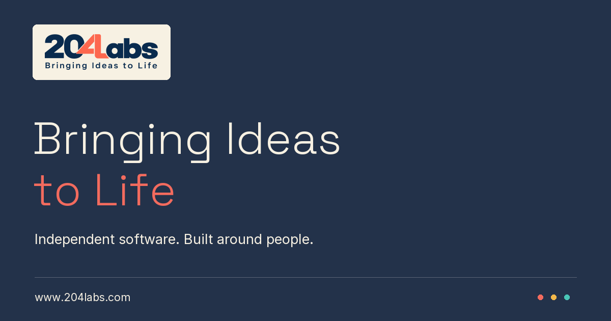

# 204Labs

The official website for [204Labs](https://www.204labs.com), an independent software company based in United Arab Emirates.

We explore overlooked problems, experiment with ideas, and build useful, human-centred software.

## Products

- [Rewizz](https://rewizzapp.github.io/rewizzapp/) — helping teachers get their time back.
- [bAIsect](https://www.baisect.com/) — for when building with AI gets you almost there.
- Tether — a calmer way to run family life.
- Lurniq — school life, brought back into one place.
- FlatIntel — know more before you sign the lease.

## Site

Static HTML, CSS and JavaScript, hosted on GitHub Pages. No build step or framework is required. Run any static HTTP server from this folder to preview it locally.

Brand assets belong to 204Labs. Third-party font and icon license notices are included alongside their files.

[Website](https://www.204labs.com) · [Email](mailto:connect@204labs.com)
